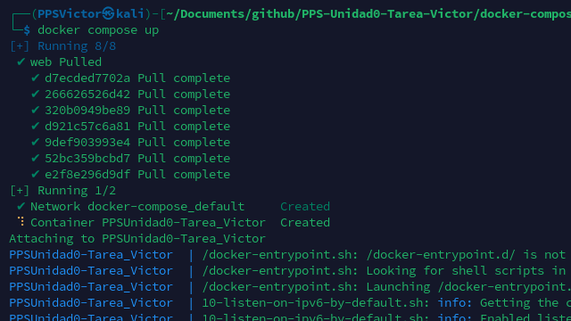
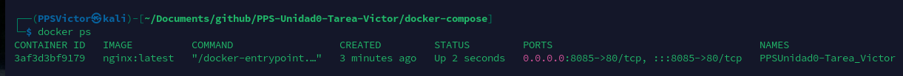

# Creación de un contenedor Docker con NGINX

En este apartado, se detalla la creación y configuración de un contenedor a través de Docker Compose. Concretamente, se detallan la configuración del archivo “*docker-compose.yml*” y la vinculación del contenedor para hostear la página web estática que contiene toda la információn que se genero con **GitHub Actions.**

## 1.0 Creación de un contenedor

Como se indica en el anterior texto, utilizaremos **Docker Compose** como nuestro ****lanzador del contenedor. Para ello, tendremos que crear un archivo, que se debe llamar `docker-compose.yml`  el cual almacenaremos dentro de nuestra carpeta ./**docker-compose.**

Esta carpeta debe de contener lo siguiente:

- docker-compose.yml —> Contiene la configuración del contenedor
- **html —> Es la carpeta que contendrá los archivos de la web estatica.**

Tras detallar la estructura, lo primero que haremos será configurar nuestro archivo de configuración. Este, debe de contener lo siguiente:

- **container_name**: Este será el nombre del contenedor.
- **image**: La imagen de referencia con la que se creará el contenedor
- **ports**: Los puertos que utilizaremos para la conexión con el contenedor.
    - En este caso sera el “8085” el puerto para nuestra máquina anfitrión.
    - El puerto “80” sera el puerto que se encuentra dentro de el contenedor (el que utiliza Nginx).
- **volumes:** Aquí detallamos las rutas que queremos que se vinculen entre el anfitrión y el contenedor, por lo que todo lo que se encuentre dentro de este sera el que Nginx hostee.

```bash
services:
  web:
    container_name: PPSUnidad0-Tarea_Victor
    image: nginx:latest
    ports:
      - "8085:80"
    volumes:
      - ./html:/usr/share/nginx/html
```

## 2.0 Lanzamiento de contenedor

Para poner en marcha el contenedor, podemos utilizar los siguientes dos comandos:

Este nos lanzará el contenedor en primer plano, por lo que veremos sus “logs”:

```bash
docker compose up
```



Si queremos que se ejecute en segundo plano:

```bash
docker compose up -d
```


